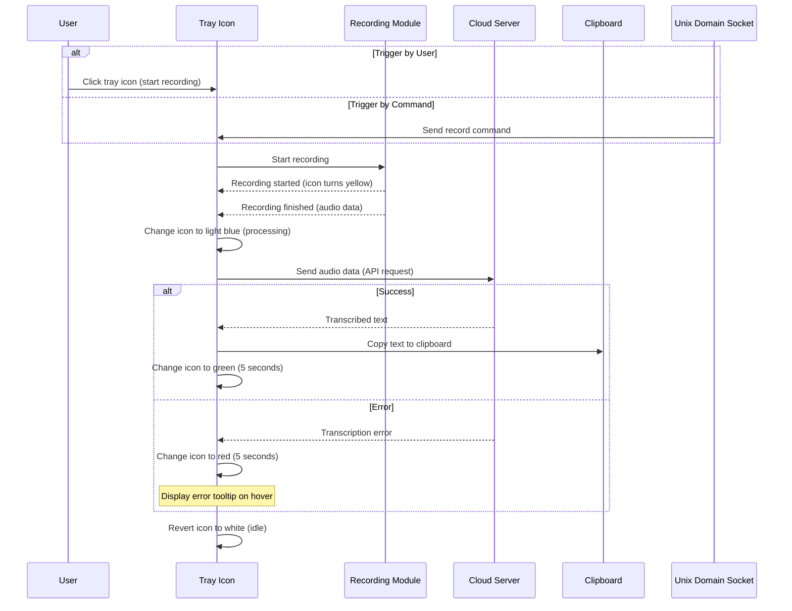

# WhisperVoiceInput


A cross-platform desktop application that records audio and transcribes it to text using OpenAI's Whisper API or compatible services. 
Perfect for dictation, note-taking, and accessibility.

## Disclaimer

The project is a tool for fulfilling my personal needs. 
I use Linux + Wayland and the tool has been tested only on this platform.

It supports only OpenAI compatible Whisper API.
Supported output methods you can find down below.

Feel free to fork the project and make it compatible with your needs.
PRs are welcome.

## Features

- **Audio Recording**: Capture audio from your system's default microphone
- **Speech-to-Text Transcription**: Convert speech to text using OpenAI's Whisper API or compatible services
- **Multiple Output Options**:
  - Copy to clipboard - The stating splash screen is a workaround for a clipboard issue (as soon as I [find a solution](https://github.com/AvaloniaUI/Avalonia/discussions/18307) I will fix it)
  - Use `wl-copy` for Wayland systems
  - Type text directly using `ydotool`
  - Type text directly using `wtype`
- **System Tray Integration**: Monitor recording status with color-coded tray icon
- **Unix Socket Control**: Control the application via command line scripts
- **Configurable Settings**:
  - API endpoint and key
  - Whisper model selection
  - Language preference
  - Custom prompts for better recognition

## Roadmap

- [ ] Remove the splash screen after clipboard issue is fixed
- [ ] Add shortcut support
- [ ] Add post-processing options

## Requirements

- .NET 9.0 or higher
- For Wayland clipboard support: `wl-copy`
- For typing output: `ydotool`
- OpenAL compatible sound card/drivers
- OpenAI API key or compatible Whisper API endpoint
  - Default OpenAI base URL: `https://api.openai.com`
  - [Default OpenAI whisper model](https://platform.openai.com/docs/models#whisper) name: `whisper-1`

## Installation

### From Source

1. Clone the repository:
   ```bash
   git clone https://github.com/yourusername/WhisperVoiceInput.git
   cd WhisperVoiceInput
   ```

2. Build the application:
   ```bash
   dotnet build -c Release
   ```

3. Run the application:
   ```bash
   dotnet run --project WhisperVoiceInput/WhisperVoiceInput.csproj
   ```

### Pre-built Binaries

Download the latest release from the [Releases](https://github.com/yourusername/WhisperVoiceInput/releases) page.

## Configuration

On first run, the application creates a configuration directory at:
```
~/.config/WhisperVoiceInput/ (Linux/macOS)
%APPDATA%\WhisperVoiceInput\ (Windows)
```

### API Configuration

1. Open the settings window by clicking on the tray icon
2. Enter your OpenAI API key or configure a compatible endpoint
3. Select the Whisper model (default: whisper-large)
4. Set your preferred language (e.g., "en" for English)
5. Optionally add a prompt to guide the transcription

### Output Configuration

Choose your preferred output method:
- **Clipboard**: Standard clipboard (uses AvaloniaUI API and works on most systems)
- **wl-copy**: For Wayland systems (requires `wl-copy` to be installed)
- **ydotool**: Types the text directly (requires `ydotool` to be installed and configured)
- **wtype**: Types the text directly (requires `wtype` to be installed and configured)

### Self-Hosted Whisper API

I personally use [Speaches](https://github.com/speaches-ai/speaches) as a self-hosted Whisper API.

An example of docker-compose file for GPU enhanced version of Speaches:
```yaml
  speaches:
    image: ghcr.io/speaches-ai/speaches:0.7.0-cuda # https://github.com/speaches-ai/speaches/pkgs/container/speaches/versions?filters%5Bversion_type%5D=tagged
    container_name: speaches
    restart: unless-stopped
    ports:
      - "1264:8000"
    volumes:
      - ./speaches_cache:/home/ubuntu/.cache/huggingface/hub
    environment:
      - ENABLE_UI=false
      - WHISPER__TTL=-1 # default TTL is 300 (5min), -1 to disable, 0 to unload directly, 43200=12h
      - WHISPER__INFERENCE_DEVICE=cuda
      - WHISPER__COMPUTE_TYPE=float16
      - WHISPER__MODEL=deepdml/faster-whisper-large-v3-turbo-ct2
      #- WHISPER__MODEL=Systran/faster-whisper-large-v3
      - WHISPER__DEVICE_INDEX=1
      - ALLOW_ORIGINS=[ "*", "app://obsidian.md" ]
      - API_KEY=sk-1234567890
      - LOOPBACK_HOST_URL=yourdomain.com
    deploy:
      resources:
        reservations:
          devices:
            - driver: nvidia
              count: all
              capabilities: [gpu]
```

## Usage

### GUI Usage

1. Click the tray icon to start/stop recording
2. When recording, the icon turns yellow
3. During transcription processing, the icon turns light blue
4. On success, the icon briefly turns green and the transcribed text is output according to your settings
5. On error, the icon turns red

### Command Line Control

The application can be controlled via Unix socket commands. Two scripts are provided:

#### Simple Toggle Script (toggle.sh)

```bash
#!/bin/bash

MESSAGE="transcribe_toggle"
PIPE_PATH="/tmp/WhisperVoiceInput/pipe"

echo "$MESSAGE" | socat - UNIX-CONNECT:$PIPE_PATH
```

#### Enhanced Toggle Script (transcribe_toggle.sh)

```bash
#!/bin/bash

MESSAGE="transcribe_toggle"
PIPE_PATH="/tmp/WhisperVoiceInput/pipe"

# Check if socat is installed
if ! command -v socat &> /dev/null; then
    echo "Error: socat is not installed. Please install it with your package manager."
    echo "For example: sudo apt install socat"
    exit 1
fi

# Check if the socket exists
if [ ! -S "$PIPE_PATH" ]; then
    echo "Error: Socket $PIPE_PATH does not exist."
    echo "Make sure WhisperVoiceInput is running."
    exit 1
fi

echo "Sending '$MESSAGE' command to WhisperVoiceInput..."
echo "$MESSAGE" | socat - UNIX-CONNECT:$PIPE_PATH
echo "Command sent."
```

Make the scripts executable:
```bash
chmod +x toggle.sh transcribe_toggle.sh
```

Run the script to toggle recording:
```bash
./toggle.sh
```

## Keyboard Shortcuts

You can bind the toggle script to a keyboard shortcut in your desktop environment for quick access:

### GNOME Example:
```bash
gsettings set org.gnome.settings-daemon.plugins.media-keys custom-keybindings "['/org/gnome/settings-daemon/plugins/media-keys/custom-keybindings/custom0/']"
gsettings set org.gnome.settings-daemon.plugins.media-keys.custom-keybinding:/org/gnome/settings-daemon/plugins/media-keys/custom-keybindings/custom0/ name "Toggle WhisperVoiceInput"
gsettings set org.gnome.settings-daemon.plugins.media-keys.custom-keybinding:/org/gnome/settings-daemon/plugins/media-keys/custom-keybindings/custom0/ command "/path/to/toggle.sh"
gsettings set org.gnome.settings-daemon.plugins.media-keys.custom-keybinding:/org/gnome/settings-daemon/plugins/media-keys/custom-keybindings/custom0/ binding "<Ctrl><Alt>w"
```

### KDE Example:
1. System Settings > Shortcuts > Custom Shortcuts
2. Add a new shortcut
3. Set the command to `/path/to/toggle.sh`
4. Assign a keyboard shortcut

## Troubleshooting

On Linux, logs are stored in `~/.config/WhisperVoiceInput/logs`
On Windows, logs are stored in `%APPDATA%\WhisperVoiceInput\logs`

Local [Seq server](https://datalust.co/seq)  is supported. I should be running on the localhost default port `5341`.

### Recording Issues

- Ensure your microphone is properly connected and set as the default input device
- Check system permissions for microphone access
- Verify OpenAL is properly installed and configured

### Transcription Issues

- Verify your API key is correct
- Check your internet connection
- Ensure the server address is correct
- Try a different Whisper model (smaller models may be faster but less accurate)

### Socket Control Issues

- Ensure the application is running
- Check if the socket file exists at `/tmp/WhisperVoiceInput/pipe`
- Verify `socat` is installed: `sudo apt install socat`

## Logs

Logs are stored in:
```
~/.config/WhisperVoiceInput/logs/ (Linux/macOS)
%APPDATA%\WhisperVoiceInput\logs\ (Windows)
```

## License

[MIT License](LICENSE)

## Acknowledgements

- [OpenAI Whisper](https://github.com/openai/whisper) - Speech recognition model
- [Avalonia UI](https://avaloniaui.net/) - Cross-platform UI framework
- [ReactiveUI](https://www.reactiveui.net/) - MVVM framework
- [NAudio](https://github.com/naudio/NAudio) - Audio library for .NET
- [OpenTK.OpenAL](https://github.com/opentk/opentk) - OpenAL bindings for .NET

## Diagrams



> Designed with [Mermaid](https://mermaid.live)