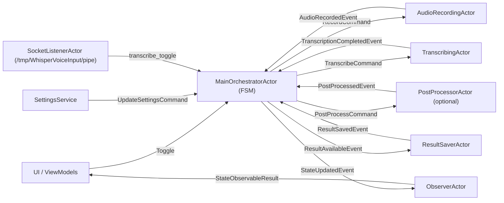
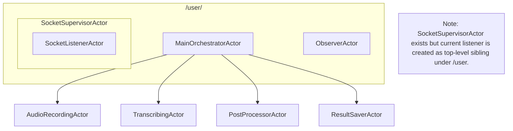
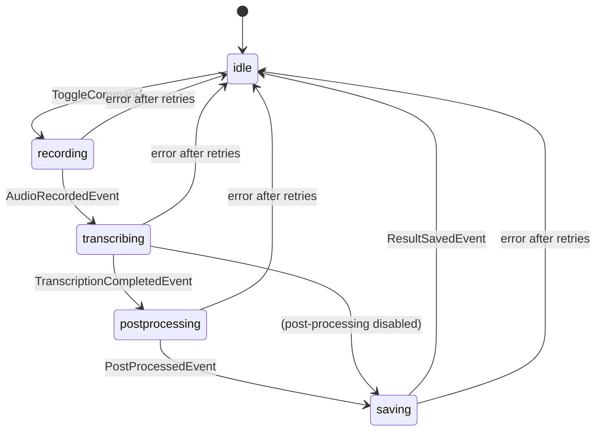
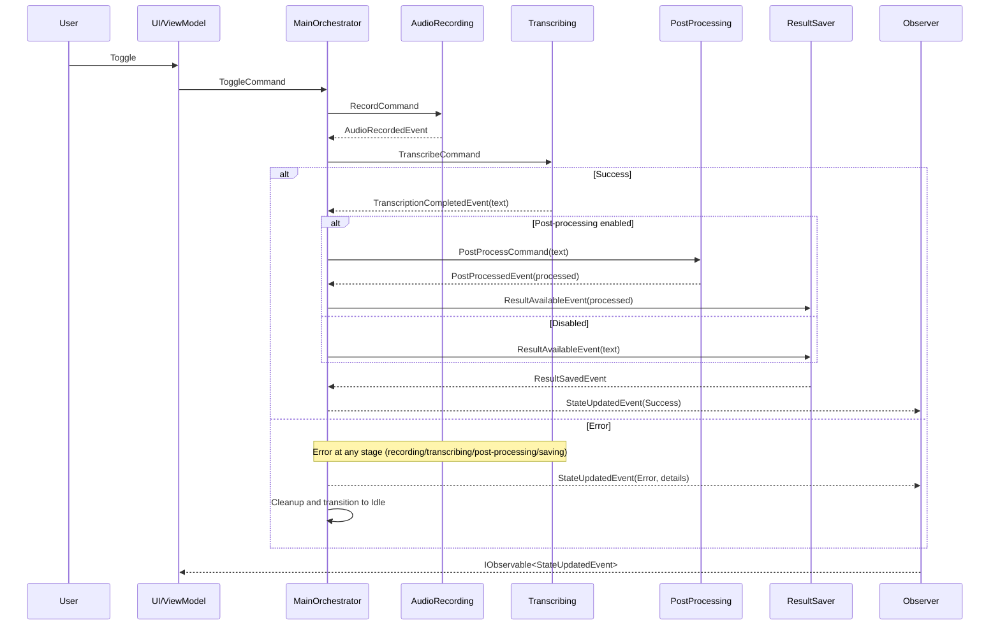

# WhisperVoiceInput


A cross-platform desktop application that records audio and transcribes it to text using OpenAI's Whisper API or compatible services. 
Perfect for dictation, note-taking, and accessibility.

## Disclaimer

The project is a tool for fulfilling my personal needs. 
I use Linux + Wayland and the tool has been tested only on this platform.

It supports only OpenAI compatible Whisper API.
Supported output methods you can find down below.

Feel free to fork the project and make it compatible with your needs.
PRs are welcome.

## What’s new (major refactor) - 10.08.2025

The backend was rewritten to an actor-based architecture using Akka.NET and the pipeline was extended with optional AI post‑processing and dataset saving. 
Comprehensive unit and integration tests were added.

Key changes:
- Akka.NET actor model with a supervised pipeline and clear FSM states
- Frozen settings per session, stashing updates while processing
- Observer actor exposes a reactive stream for UI state updates
- Optional post‑processing via Microsoft.Extensions.AI (OpenAI‑compatible)
- Optional dataset saving (original → processed pairs) when post‑processing is enabled
- Robust error handling and retries per actor (configurable policy)
- Tests: FSM/unit, pipeline integration with deterministic timing, and error scenarios

## Features

- Audio Recording: Capture audio from selected microphone (system default or user‑selected)
- Speech-to-Text Transcription: Convert speech to text using OpenAI's Whisper API or compatible services
- Multiple Output Options:
  - Copy to clipboard (Avalonia clipboard; splash workaround due to platform issue)
  - Use `wl-copy` for Wayland systems
  - Type text directly using `ydotool`
  - Type text directly using `wtype`
- System Tray Integration: Monitor recording status with color-coded tray icon
- Unix Socket Control: Control the application via command line scripts
- Configurable Settings:
  - API endpoint and key
  - Whisper model selection
  - Language preference
  - Custom prompts for better recognition
- Optional Post‑Processing: Improve text with an LLM via Microsoft.Extensions.AI
- Optional Dataset Saving (for ML datasets): Append original and processed pairs when post‑processing is enabled (see Configuration → Dataset Saving)

## Roadmap

- [ ] Remove the splash screen after clipboard issue is fixed
- [ ] Add shortcut support
- [x] Add more post-processing options

## Requirements

- .NET 9.0 or higher
- For Linux: `lame`, `socat` (for socket control)
- For Wayland clipboard support: `wl-copy`
- For typing output: `ydotool` or `wtype`
- OpenAL compatible sound card/drivers
- OpenAI API key or compatible Whisper API endpoint
  - OpenAI base URL: `https://api.openai.com`
  - OpenAI model name: `whisper-1`
  - Self-hosted servers often use Whisper Large variants (e.g., faster‑whisper). The UI defaults use a large model name. Adjust to `whisper-1` if you call OpenAI directly.

## Installation

### Prerequisites

- For Linux: Install `lame` from your package manager.

### From Source

1. Clone the repository:
   ```bash
   git clone https://github.com/yourusername/WhisperVoiceInput.git
   cd WhisperVoiceInput
   ```

2. Build the application:
   ```bash
   dotnet build -c Release
   ```

3. Run the application:
   ```bash
   dotnet run --project WhisperVoiceInput/WhisperVoiceInput.csproj
   ```

### Pre-built Binaries

Download the latest release from the [Releases](https://github.com/V0v1kkk/WhisperVoiceInput/releases) page.

## Configuration

On first run, the application creates a configuration directory at:
```
~/.config/WhisperVoiceInput/ (Linux/macOS)
%APPDATA%\WhisperVoiceInput\ (Windows)
```

### API Configuration

1. Open the settings window by clicking on the tray icon
2. Enter your OpenAI API key or configure a compatible endpoint
3. Select the Whisper model
   - OpenAI: `whisper-1`
   - Self-hosted: a Faster-Whisper model name (e.g., `whisper-large-v3`)
4. Set your preferred language (e.g., "en")
5. Optionally add a prompt to guide the transcription

### Audio Input Device Selection

- In Settings → Audio Settings, use the “Input Device” dropdown to choose a microphone:
  - `System default` uses your OS default input device.
  - Or select a specific device from the list.
- Click “Refresh” to enumerate devices on demand (keeps startup/settings opening light‑weight).
  - Under the hood, the app queries OpenAL capture devices and, when supported, also uses the extended enumeration to include more (e.g., virtual) devices.
- The selection is saved as a plain string setting (`PreferredCaptureDevice`).
  - Empty value means `System default`.
- If the preferred device is unavailable at runtime, the recorder automatically falls back to the system default.

### Output Configuration

Choose your preferred output method:
- Clipboard (Avalonia API)
- wl-copy (Wayland)
- ydotool (types the text)
- wtype (types the text)

### Post-Processing (optional)

- Enable to improve transcriptions via Microsoft.Extensions.AI
- Endpoint and model are OpenAI‑compatible (OpenAI or local LLM gateways)
- Defaults in the app may point to a local endpoint and model (e.g., Ollama `http://localhost:11434` with `llama3.2`); adjust as needed
- Provide API key if your endpoint requires it

### Dataset Saving (optional)

Build your own training datasets from the pipeline output.

- Availability: Only works when Post‑Processing is enabled
- Format per entry:
  ```
  <original text>
  -
  <processed text>
  ---
  ```
- How to enable:
  1. In Settings, enable Post‑Processing
  2. Turn on "Save dataset"
  3. Choose the target file path (created if missing)
  4. Run the pipeline; after post‑processing, an entry is appended asynchronously
- Notes:
  - Appends are non-blocking and won’t stall the UI
  - Success and errors are logged
  - Ensure the chosen location is writable by your user

### Self-Hosted Whisper API

I personally use [Speaches](https://github.com/speaches-ai/speaches) as a self-hosted Whisper API.

An example of docker-compose file for GPU enhanced version of Speaches:
```yaml
  speaches:
    image: ghcr.io/speaches-ai/speaches:0.7.0-cuda # https://github.com/speaches-ai/speaches/pkgs/container/speaches/versions?filters%5Bversion_type%5D=tagged
    container_name: speaches
    restart: unless-stopped
    ports:
      - "1264:8000"
    volumes:
      - ./speaches_cache:/home/ubuntu/.cache/huggingface/hub
    environment:
      - ENABLE_UI=false
      - WHISPER__TTL=-1 # default TTL is 300 (5min), -1 to disable, 0 to unload directly, 43200=12h
      - WHISPER__INFERENCE_DEVICE=cuda
      - WHISPER__COMPUTE_TYPE=float16
      - WHISPER__MODEL=deepdml/faster-whisper-large-v3-turbo-ct2 # uses ~2.5Gb VRAM in CUDA version
      #- WHISPER__MODEL=Systran/faster-whisper-large-v3
      - WHISPER__DEVICE_INDEX=1
      - ALLOW_ORIGINS=[ "*", "app://obsidian.md" ]
      - API_KEY=sk-1234567890
      - LOOPBACK_HOST_URL=yourdomain.com
    deploy:
      resources:
        reservations:
          devices:
            - driver: nvidia
              count: all
              capabilities: [gpu]
```

## Usage

### GUI Usage

1. Click the tray icon to start/stop recording
2. When recording, the icon turns yellow
3. During transcription/post‑processing/saving, the icon turns light blue
4. On success, the icon briefly turns green and the text is output per your settings
5. On error, the icon turns red and a tooltip shows details

### Command Line Control

The application can be controlled via a Unix socket. Two scripts are provided in the repo root:

- `transcribe_toggle_simplified.sh` (simple)
- `transcribe_toggle.sh` (enhanced checks)

Make the scripts executable:
```bash
chmod +x transcribe_toggle_simplified.sh transcribe_toggle.sh
```

Run to toggle recording:
```bash
./transcribe_toggle_simplified.sh
```

## Keyboard Shortcuts

Bind a shortcut in your DE to run the toggle script (examples below).

### GNOME Example:
```bash
gsettings set org.gnome.settings-daemon.plugins.media-keys custom-keybindings "['/org/gnome/settings-daemon/plugins/media-keys/custom-keybindings/custom0/']"
gsettings set org.gnome.settings-daemon.plugins.media-keys.custom-keybinding:/org/gnome/settings-daemon/plugins/media-keys/custom-keybindings/custom0/ name "Toggle WhisperVoiceInput"
gsettings set org.gnome.settings-daemon.plugins.media-keys.custom-keybinding:/org/gnome/settings-daemon/plugins/media-keys/custom-keybindings/custom0/ command "/path/to/transcribe_toggle_simplified.sh"
gsettings set org.gnome.settings-daemon.plugins.media-keys.custom-keybinding:/org/gnome/settings-daemon/plugins/media-keys/custom-keybindings/custom0/ binding "<Ctrl><Alt>w"
```

### KDE Example:
1. System Settings > Shortcuts > Custom Shortcuts
2. Add a new shortcut
3. Set the command to `/path/to/transcribe_toggle_simplified.sh`
4. Assign a keyboard shortcut

## Troubleshooting

Local [Seq server](https://datalust.co/seq) is supported and should be reachable on `http://localhost:5341`.

### Recording Issues

- Ensure your microphone is properly connected and set as the default input device
- Check system permissions for microphone access
- Verify OpenAL is properly installed and configured

### Transcription Issues

- Verify your API key is correct (if required by your endpoint)
- Check your internet connection
- Ensure the server address is correct
- Try a different Whisper model (smaller models may be faster but less accurate)

### Post‑Processing Issues

- Verify endpoint URL, model, and API key
- If using a local LLM gateway, confirm it’s running and reachable

### Socket Control Issues

- Ensure the application is running
- Check if the socket file exists at `/tmp/WhisperVoiceInput/pipe`
- Verify `socat` is installed: `sudo apt install socat`

## Logs

On Linux/macOS: `~/.config/WhisperVoiceInput/logs/`
On Windows: `%APPDATA%\WhisperVoiceInput\logs\`

## Architecture (actor-based)

Actors and responsibilities:
- MainOrchestratorActor (FSM): Coordinates the pipeline (Idle → Recording → Transcribing → PostProcessing → Saving). Supervises children, freezes settings per session, stashes settings updates, notifies UI via Observer.
- AudioRecordingActor: Records from OpenAL and writes MP3 using NAudio.Lame. Emits AudioRecordedEvent.
- TranscribingActor: Calls `{ServerAddress}/v1/audio/transcriptions` with model/language/prompt. Emits TranscriptionCompletedEvent. Handles temp file cleanup/move.
- PostProcessorActor (optional): Uses Microsoft.Extensions.AI to enhance text. Emits PostProcessedEvent.
- ResultSaverActor: Outputs final text per selected strategy (clipboard, wl-copy, ydotool, wtype). Emits ResultSavedEvent.
- ObserverActor: Bridges actor system to UI with IObservable<StateUpdatedEvent>.
- SocketListenerActor (Linux): Listens on `/tmp/WhisperVoiceInput/pipe` and forwards `transcribe_toggle` to the orchestrator.

Primary messages:
- Commands: ToggleCommand, UpdateSettingsCommand, RecordCommand, StopRecordingCommand, TranscribeCommand(audioPath), PostProcessCommand(text), StartListeningCommand, StopListeningCommand, GetStateObservableCommand
- Events: AudioRecordedEvent, TranscriptionCompletedEvent, PostProcessedEvent, ResultAvailableEvent, ResultSavedEvent, StateUpdatedEvent, StateObservableResult

## Testing

A dedicated test project validates the actor pipeline.

- FSM/Unit tests for `MainOrchestratorActor` transitions and messaging
- Pipeline integration tests using `TestScheduler` for deterministic timing
- Error scenario tests (network timeouts, auth failures, file not found, multi‑error cases)
- Dataset saving behavior with and without post‑processing

Project layout (simplified):
```
WhisperVoiceInput.Tests/
  Actors/
    MainOrchestratorActorTests.cs
    PipelineIntegrationTests.cs
    SpecificErrorScenariosTests.cs
  TestBase/
    AkkaTestBase.cs
  TestDoubles/
    ... (probes, mocks, configurable error actors)
```

## Diagrams

### Data Flow



### Supervision (runtime)



### FSM States



### Sequence (happy path + error path)



## License

[MIT License](LICENSE)

## Acknowledgements

- [OpenAI Whisper](https://github.com/openai/whisper) - Speech recognition model
- [Avalonia UI](https://avaloniaui.net/) - Cross-platform UI framework
- [ReactiveUI](https://www.reactiveui.net/) - MVVM framework
- [NAudio](https://github.com/naudio/NAudio) - Audio library for .NET
- [OpenTK.OpenAL](https://github.com/opentk/opentk) - OpenAL bindings for .NET
- [Akka.NET](https://getakka.net/) — Actor framework
- [Microsoft.Extensions.AI](https://learn.microsoft.com/en-us/dotnet/ai/microsoft-extensions-ai) — AI abstractions for post‑processing